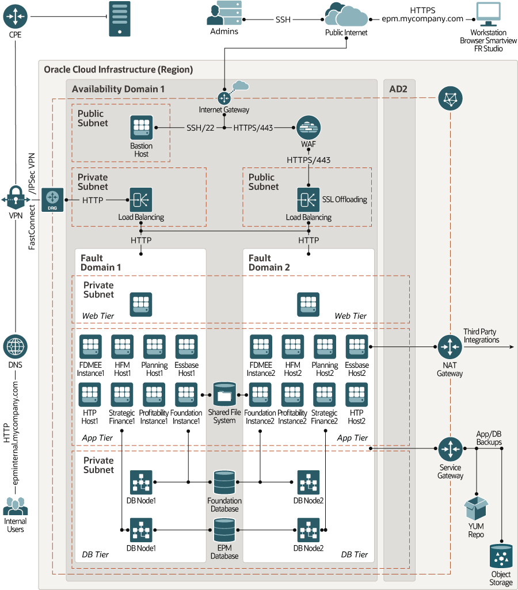
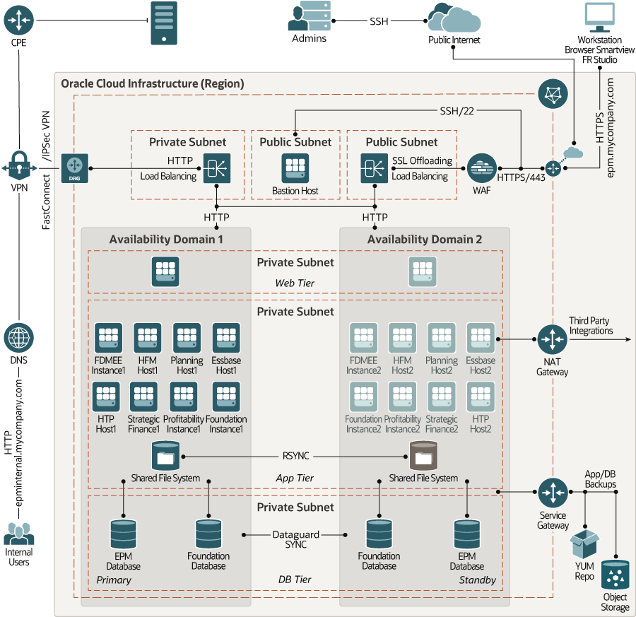

# **Terraform modules for Hyperion on Oracle Cloud Infrastructure**
[![Deploy to Oracle Cloud][magic_button]][magic_hyperion_stack]

These Terraform modules can be used to provision infrastructure for Oracle Enterprise management (Hyperion) on Oracle Cloud Infrastructure. Hyperion can be deployed on Oracle Cloud Infrastructure in single availability domain or multi availability domain architecture.The modules can be used to create infrastructure for Hyperion in single Availability Domain as well as multiple Availability Domains.

### **Architecture for Deploying Hyperion in a Single Availability domain**


### **Architecture for Deploying Hyperion in multiple Availability domains**


For information on Hyperion deployment architecture on Oracle Cloud Infrastructure, see

- [HA Architecture: Single Availability Domain](https://docs.oracle.com/en/solutions/design-hyperion-oci/active-active-deployments1.html#GUID-AA3B80FF-9146-4B93-98AC-09494CF1FFA6)
- [HA Architecture: Multiple Availability Domains](https://docs.oracle.com/en/solutions/design-hyperion-oci/active-passive-deployments1.html#GUID-53B52BAB-B47D-425F-A6E3-F3331FCE99799)

## **How to use this module**

**Note: The template use [Windows Server 2016 image](https://docs.cloud.oracle.com/en-us/iaas/images/image/943bdefa-8858-4b37-98e0-fd710c4aea1e/) for provisoning the servers.** 

### **Using OCI Resource Manager**
1. Click [![Deploy to Oracle Cloud][magic_button]][magic_hyperion_stack]

   If you aren't already signed in, when prompted, enter the tenancy and user credentials.

2. Review and accept the terms and conditions.

3. Select the region where you want to deploy the stack.

4. Follow the on-screen prompts and instructions to create the stack.

5. After creating the stack, click Terraform Actions, and select Plan.

6. Wait for the job to be completed, and review the plan.
   
   To make any changes, return to the Stack Details page, click Edit Stack, and make the required changes. Then, run the Plan action again.

7. If no further changes are necessary, return to the Stack Details page, click Terraform Actions, and select Apply.


### **Using Terraform CLI**
First off you'll need to do some pre deploy setup.  That's all detailed [here](https://github.com/oracle-quickstart/oci-prerequisites). A terraform version of 0.13.x is required.

1. Clone the repo

  ```
  $ git clone https://github.com/oracle-quickstart/oci-hyperion.git
  $ cd oci-hyperion
  ```

2. Update **env-vars** with the required information. The file contains definitions of environment variables for your Oracle Cloud Infrastructure tenancy.

3. Rename **terraform.tfvars.template** to **terraform.tfvars**.Update **terraform.tfvars** with the inputs for the architecture that you want to build. A running sample terraform.tfvars file for multiple availability domain architecture is available below. The contents of sample file can be copied to create a running terraform.tfvars input file. Update db_admin_password with actual password in terraform.tfvars file.

4. Initialize Terraform. This will also download the latest terraform oci provider.

  ```
  $ terraform init
  ```
5. Set environment variables by running source **env-vars** on your UNIX system. 

  ```
  $ source env-vars
  ```

6. Run terraform plan.

  ```
  $ terraform plan
  ```

7. Run terraform apply to create the infrastructure:

  ```
  $ terraform apply
  ```

When you’re prompted to confirm the action, enter **yes**.

When all components have been created, Terraform displays a completion message. For example: Apply complete! Resources: 81 added, 0 changed, 0 destroyed.

8. If you want to delete the infrastructure, run:

  ```
  $ terraform destroy
  ```

When you’re prompted to confirm the action, enter **yes**.

## **Inputs required in the terraform.tfvars file**

The following inputs are required for terraform modules:

| Argument                   | Description                                                                                                                                                                                                                                                                                                                                                       |
| -------------------------- | ----------------------------------------------------------------------------------------------------------------------------------------------------------------------------------------------------------------------------------------------------------------------------------------------------------------------------------------------------------------- |
| AD                         | Availability Domain for Hyperion Deployment. This variable drives the Hyperion architecture to be deployed. Setting AD = ["1"] deploys infrastructure in single availability domain (Availabilty domain 1 of the tenancy) and AD = ["1","2"] deploys infrastructure in multiple ADs (Availability domains 1 and 2 of the tenancy). |
| vcn_cidr                   | CIDR block of the VCN (Virtual Cloud Network) to be created.                                                                                                                                                                                                      |
| vcn_dns_label              | DNS Label of the VCN (Virtual Cloud Network) to be created.                                                                                                                                                                                                                                                                                                                               |
| freeform_tags                 | Freeform tag for resource. | 
| ebs_env_prefix                 | Environment prefix to define names of Oracle Cloud infrastructure. resources.                                                                                                                                                                                                                                                                                                                   |
| epm_financial_management                 | Whether create infrastructure for EPM Financial Management. The value can be “true” or “false”.                                                                                                                                                                                                                                                                                                                   |
| epm_hfm_instance_count                 | Number of Financial Management instances.                                                                                                                                                                                                                                                                                                                   |
| epm_hfm_instance_shape                 | Shape of Financial Management instance.                                                                                                                                                                                                                                                                                                                 |
| epm_hfm_instance_bv_size_in_gb                 | Block volume size of Financial Management instance.                                                                                                                                                                                                                                                                                                                 |
| epm_hfm_instance_bv_vpus_per_gb                 | Block volume VPUs per GB.                                                                                                                                                                                                                                                                                                         |
| epm_htp_required                 | Whether create infrastructure for Hyperion Tax Provision. The value can be “true” or “false”.                                                                                                                                                                                                                                                                                                                   |
| epm_htp_instance_count                 | Number of Hyperion Tax Provision instances.                                                                                                                                                                                                                                                                                                                   |
| epm_htp_instance_shape                 | Shape of Hyperion Tax Provision instance.                                                                                                                                                                                                                                                                                                                   |
| epm_htp_instance_bv_size_in_gb                 | Block volume size of Hyperion Tax Provision instance.                                                                                                                                                                                                                                                                                                                   |
| epm_htp_instance_bv_vpus_per_gb                 | Block volume VPUs per GB.                                                                                                                                                                                                                                                                                                                  |
| epm_planning                 | Whether create infrastructure for Planning. The value can be “true” or “false”.                                                                                                                                                                                                                                                                                                                   |
| epm_planning_instance_count                 | Number of Planning instances.                                                                                                                                                                                                                                                                                                                   |
| epm_planning_instance_shape                 | Shape of Planning instance.                                                                                                                                                                                                                                                                                                                   |
| epm_planning_instance_bv_size_in_gb                 | Block volume size of Planning instance.                                                                                                          |
| epm_planning_instance_bv_vpus_per_gb                 | Block volume VPUs per GB.
| epm_essbase_instance_count                 | Number of Essbase instances.                                                                                                                                                                                                                                                                                                                   |
| epm_essbase_instance_shape                 | Shape of Essbase instance.                                                                                                                                                                                                                                                                                                                   |
| epm_essbase_instance_bv_size_in_gb                 | Block volume size of Essbase instance.                                                                                                                                                                                                                                                                                                                   |
| epm_essbase_instance_bv_vpus_per_gb                 | Block volume VPUs per GB.
| epm_foundation_instance_count                 | Number of Foundation instances.                                                                                                                                                                                                                                                                                                                   |
| epm_foundation_instance_shape                 | Shape of Foundation instance.                                                                                                                                                                                                                                                                                                                   |
| epm_foundation_instance_bv_size_in_gb                 | Block volume size of Foundation instance.                                                                                                                        
| epm_foundation_instance_bv_vpus_per_gb                 | Block volume VPUs per GB.
| foundation_db_separate                 | Whether create separate database for Foundation Services. The value can be “true” or “false”. 
| foundation_db_edition                 | Edition of database.     
| foundation_db_license_model           | Licensing model for database.                                                                                                                                                                                                                                                                                                                                     |
| foundation_db_version                 | Version of database.                                                                                                                                                                                                                                                                                                                                              |
| foundation_db_node_count              | Number of database nodes. For single instance database, this parameter should be 1 and for Real Application Cluster Database, this parameter should be set to 2.                                                                                                                                                                                                  |
| foundation_db_instance_shape          | Shape of Database nodes. For RAC, the minimum required shape is VMStandard2.2.                                                                                                                                                                                                                                                                                    |  
| foundation_db_name                    | Name of Database Container.                                                                                                                                                                                                                                                                                                                                                    |
| foundation_db_size_in_gb              | Size of database in gb. For more information, see [Oracle Cloud Infrastructure Images](https://docs.cloud.oracle.com/iaas/images/)                                                                                                                                                                                                                                      |
| foundation_db_admin_password          | Database administration password (sys password).                                                                                                                                                                                                                                                                                                                  |  
| foundation_db_characterset            | Characterset of database.                                                                                                                                                                                                                                                                                                                                         |
| foundation_db_nls_characterset        | National Characterset of database.                                                                                                                                                                                                                                                                                                                                     |                                                                                                                                                                                                                                                                                                                                     |
| foundation_pdb_name                | Pluggable database name.     
| add_additional_products                 | Whether create infrastructure for additional EPM products. The value can be “true” or “false”.                                                                                                                                                                                                                                                                                                                   |
| epm_profitability_required                 | Whether create infrastructure for Profitability. The value can be “true” or “false”.                                                                                                                                                                                                                                                                                                                   
| epm_profitability_instance_count                 | Number of Profitability instances.                                                                                                                                                                                                                                                                                                                   |
| epm_profitability_instance_shape                 | Shape of Profitability instance.                                                                                                                                                                                                                                                                                                                   |
| epm_profitability_instance_bv_size_in_gb                 | Block volume size of Profitability instance                                                                                                                                                                                                                                                                                                                   |
| epm_profitability_instance_bv_vpus_per_gb                 | Block volume VPUs per GB.    
| epm_strategic_finance_required                 | Whether create infrastructure for Strategic Finance. The value can be “true” or “false”.                                                                                                                                                                                                                                                                                                                   
| epm_strategic_finance_instance_count                 | Number of Strategic Finance instances.                                                                                                                                                                                                                                                                                                                   |
| epm_strategic_finance_instance_shape                 | Shape of Strategic Finance instance.                                                                                                                                                                                                                                                                                                                   |
| epm_strategic_finance_instance_bv_size_in_gb                 | Block volume size of Strategic Finance instance.                                                                                                                                                                                                                                                                                                                   |
| epm_strategic_finance_instance_bv_vpus_per_gb                 | Block volume VPUs per GB.    
| epm_fdmee_required                 | Whether create infrastructure for FDMEE. The values can be “true” or “false”.                                                                                                                                                                                                                                                                                                                   
| epm_fdmee_instance_count                 | Number of FDMEE instance.                                                                                                                                                                                                                                                                                                                   |
| epm_fdmee_instance_shape                 | Shape of FDMEE instance.                                                                                                                                                                                                                                                                                                                   |
| epm_fdmee_instance_bv_size_in_gb                 | Block volume size of FDMEE instance.                                                                                                                                                                                                                                                                                                                |
| epm_fdmee_instance_bv_vpus_per_gb                 | Block volume VPUs per GB.    |
| epm_web_instance_count                 | Number of Web instances.                                                                                                                                                                                                                                                                                                                  |
| epm_web_instance_shape                 | Shape of Web instance.                                                                                                                                                                                                                                                                                                                   |
| epm_web_instance_listen_port                 | Listen port of Web instance.                                                                                                                                                                                                                                                                                                                   |
| epm_web_instance_bv_size_in_gb                  | Block volume size of Web instance.                                                                                                                                                                                                                                                                                                                   |
| epm_web_instance_bv_vpus_per_gb                 | Block volume VPUs per GB.    
| epm_database_required           | Whether create database for EPM.The values can be “true” or “false”.                                                                                                                                                                                                                                                                                                                                                                                                            |
| db_edition                 | Edition of database.     
| db_license_model           | Licensing model for database.                                                                                                                                                                                                                                                                                                                                     |
| db_version                 | Version of database.                                                                                                                                                                                                                                                                                                                                              |
| db_node_count              | Number of database nodes. For single instance database, this parameter should be 1 and for Real Application Cluster Database, this parameter should be set to 2.                                                                                                                                                                                                  |
| db_instance_shape          | Shape of Database nodes. For RAC, the minimum required shape is VMStandard2.2.                                                                                                                                                                                                                                                                                    |  
| db_name                    | Name of Database Container.                                                                                                                                                                                                                                                                                                                                                    |
| db_size_in_gb              | Size of database in gb. For more information, see [Oracle Cloud Infrastructure Images](https://docs.cloud.oracle.com/iaas/images/)                                                                                                                                                                                                                                      |
| db_admin_password          | Database administration password (sys password).                                                                                                                                                                                                                                                                                                                  |  
| db_characterset            | Characterset of database.                                                                                                                                                                                                                                                                                                                                         |
| db_nls_characterset        | National Characterset of database.                                                                                                                        
| db_pdb_name                | Starter Pluggable database name.     
| load_balancer_hostname     | Hostname of the load balancer.                                                                                                                                                                                                                                                                                                                                    |
| load_balancer_shape        | Shape of the load balancer.                                                                                                                                                                                                                                                                                                                                       |
| load_balancer_listen_port  | Listen port of the load balancer.                                                                                                                                                                                                                                                                                                                                 |

##### **Sample terraform.tfvars file to create Hyperion infrastructure in single availability domain architecture**

```hcl
# AD (Availability Domain to use for creating EBS infrastructure) 
# For single AD regions (ap-seoul-1, ap-tokyo-1, ca-toronto-1), use AD = ["1"] 
# AD (Availability Domain to use for creating EPM infrastructure) 
AD = ["1"]

# CIDR block of VCN to be created
vcn_cidr = "172.16.0.0/16"

# DNS label of VCN to be created
vcn_dns_label = "epmvcn"

#Environment prefix to define name of resources
epm_env_prefix = "epm"

# Freeform tags
freeform_tags = { environment = "prod", costcenter = "10240" }


#----------- EPM Financial Management Configuration ------------------------
# Whether create infrastructure for EPM Financial Management
epm_financial_management = true

# Number of Financial Management instances
epm_hfm_instance_count = "1"

# Shape of Financial Management instance
epm_hfm_instance_shape =  "VM.Standard2.1"

# Block volume size of Financial Management instance
epm_hfm_instance_bv_size_in_gb =  "100"

# Block volume VPUs per GB 
epm_hfm_instance_bv_vpus_per_gb = "0"

# Whether create infrastructure for Hyperion Tax Planning with Financial Management
epm_htp_required = true

# Number of Hyperion Tax Provision instances
epm_htp_instance_count = "0"

# Shape of Hyperion Tax Provision instance
epm_htp_instance_shape =  "VM.Standard2.1"

# Block volume size of Hyperion Tax Provision instance
epm_htp_instance_bv_size_in_gb =  "100"

# Block volume VPUs per GB 
epm_htp_instance_bv_vpus_per_gb = "0"
#---------------------------------------------------------------------------

#----------- EPM Planning Configuration ------------------------------------
# Whether create infrastructure for EPM Planning
epm_planning = "false"

# Number of EPM Planning instances
epm_planning_instance_count = "0"

# Shape of EPM Planning instance
epm_planning_instance_shape =  "VM.Standard2.1"

# Block volume size of EPM Planning instance
epm_planning_instance_bv_size_in_gb =  "100"

# Block volume VPUs per GB
epm_planning_instance_bv_vpus_per_gb = "0"

# Number of EPM Essbase instances
epm_essbase_instance_count = "0"

# Shape of EPM Essbase instance
epm_essbase_instance_shape =  "VM.Standard2.1"

# Block volume size of EPM Essbase instance
epm_essbase_instance_bv_size_in_gb =  "100"

# Block volume VPUs per GB
epm_essbase_instance_bv_vpus_per_gb = "0"
#---------------------------------------------------------------------------

#----------- EPM Foundation Configuration ----------------------------------
# Number of EPM Foundation instances
epm_foundation_instance_count = "1"

# Shape of EPM Foundation instance
epm_foundation_instance_shape =  "VM.Standard2.1"

# Block volume size of EPM Foundation instance
epm_foundation_instance_bv_size_in_gb =  "100"

# Block volume VPUs per GB
epm_foundation_instance_bv_vpus_per_gb = "0"

# Whether create separate database for Foundation services
foundation_db_separate = true

# Foundation services database edition
foundation_db_edition = "ENTERPRISE_EDITION_EXTREME_PERFORMANCE"

# Licensing model for Foundation services database
foundation_db_license_model = "LICENSE_INCLUDED"

# Database version for Foundation services database
foundation_db_version =  "12.1.0.2"

# Number of database nodes for Foundation services database
foundation_db_node_count =  "2"

# Database Name for Foundation services database 
foundation_db_name =  "FNDCDB"

# PDB Name for Foundation services database 
foundation_pdb_name =  "FNDPRD"

# DB admin password for Foundation services database
foundation_db_admin_password =  "<password>"

#Shape of Database nodes for Foundation services
foundation_db_instance_shape =  "VM.Standard2.2"

#Size of Database
foundation_db_size_in_gb = "256"

# Characterset of database
foundation_db_characterset = "AL32UTF8"

# National Characterset of database
foundation_db_nls_characterset = "AL16UTF16"

#---------------------------------------------------------------------------

#----------- EPM Additional Products Configuration ------------------------
# Whether create infrastructure for addtional products
add_additional_products = "false"

# Whether create infrastructure for EPM Profitability
epm_profitability_required = "false"

# Number of Profitability instances
epm_profitability_instance_count = "0"

# Shape of Profitability instance
epm_profitability_instance_shape =  "VM.Standard2.1"

# Block volume size of Profitability instance
epm_profitability_instance_bv_size_in_gb =  "100"

# Block volume VPUs per GB
epm_profitability_instance_bv_vpus_per_gb = "0"

####### EPM Strategic Finance Instance  ################

# Whether create infrastructure for Strategic Finance
epm_strategic_finance_required = "false"

# Number of Strategic Finance instances
epm_strategic_finance_instance_count = "0"

# Shape of Strategic Finance instance
epm_strategic_finance_instance_shape =  "VM.Standard2.1"

# Block volume size of Strategic Finance instance
epm_strategic_finance_instance_bv_size_in_gb =  "100"

# Block volume VPUs per GB
epm_strategic_finance_instance_bv_vpus_per_gb = "0"

####### EPM FDMEE Instance  ##############################
# Whether create infrastructure for FDMEE 
epm_fdmee_required = "false"

# Number of FDMEE instances
epm_fdmee_instance_count = "0"

# Shape of FDMEE instance
epm_fdmee_instance_shape =  "VM.Standard2.1"

# Block volume size of FDMEE instance
epm_fdmee_instance_bv_size_in_gb =  "100"

# Block volume VPUs per GB
epm_fdmee_instance_bv_vpus_per_gb = "0"

#---------------------------------------------------------------------------

#----------- EPM Web Configuration ------------------------
# Number of web instances
epm_web_instance_count = "0"

# Shape of web instance
epm_web_instance_shape =  "VM.Standard2.1"

# Listen port range of web instance
epm_web_instance_listen_port_range = "19000"

# Block volume size of web instance
epm_web_instance_bv_size_in_gb =  "100"

# Block volume VPUs per GB
epm_web_instance_bv_vpus_per_gb = "0"

#---------------------------------------------------------------------------

#----------- EPM Database Configuration ------------------------
####### EPM Hyperion Database ###########################

#Whether EPM database is required to be provisioned
epm_database_required = true

# Database Edition
db_edition = "ENTERPRISE_EDITION_EXTREME_PERFORMANCE"

# Licensing model for database
db_license_model = "LICENSE_INCLUDED"

# Database version
db_version =  "12.1.0.2"

# Number of database nodes
db_node_count =  "2"

#Shape of Database nodes
db_instance_shape =  "VM.Standard2.2"

#Database name
db_name =  "EPMCDB"

#Size of Database
db_size_in_gb = "256"

# Database administration (sys) password
db_admin_password = "<password>"

# Characterset of database
db_characterset = "AL32UTF8"

# National Characterset of database
db_nls_characterset = "AL16UTF16"

# Pluggable database name
db_pdb_name = "EPMPRD"
#---------------------------------------------------------------------------

#----------- EPM Load Balancer Configuration ------------------------

# Whether private load balancer is required
load_balancer_private = "False"

# Hostname of Load Balancer
load_balancer_hostname =  "epm.mycompany.com"

# Shape of Load Balancer
load_balancer_shape = "100Mbps"

#Listen port of load balancer
load_balancer_listen_port =  "443"

#---------------------------------------------------------------------------
```

If you want to deploy Hyperion on Oracle Cloud Infrastructure in multi availability domain architecture, set AD variable to

```hcl
AD = ["1","2"]
```
[magic_button]: https://oci-resourcemanager-plugin.plugins.oci.oraclecloud.com/latest/deploy-to-oracle-cloud.svg
[magic_hyperion_stack]: https://cloud.oracle.com/resourcemanager/stacks/create?region=home&zipUrl=https://github.com/oracle-quickstart/oci-hyperion/archive/master.zip
